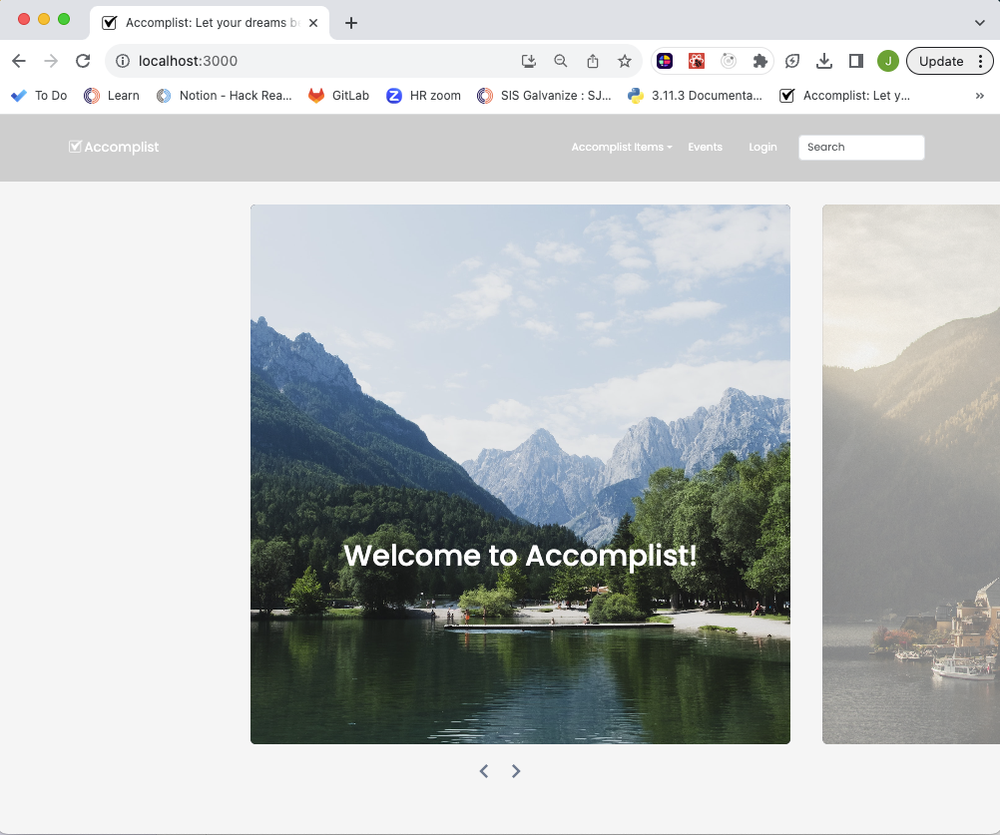

## Accomplist Documentation

- Christopher Byrne
- Kacton Devoti
- Michael Hogan
- Joanna McPherson

Accomplist - Because goals are more fun with friends!

## Design
- [API design](docs/apis.md)
- [Data model](docs/data-model.md)
- [GHI](docs/ghi.md)
- [Integrations](docs/integrations.md)

## Local Project Initialization
**  Make sure you have Docker, Git, and Node.js installed e**

1.  Fork this repository https://gitlab.com/two-direction/accomplist

2.  Clone the forked repository onto your local computer:
git clone https://gitlab.com/two-direction/accomplist/<your-gitlab-username-here>

3.  Change directory to your project directory and build and run the project using Docker with these commands:
```
docker volume create accomplist
docker volume create pg-admin
docker-compose build
docker-compose up
```
-   After running these commands, make sure all of your Docker containers are running

-   View the project in the browser: http://localhost:3000/
Screenshot of website



# Functionality
-Visitors to the site can create an account with a profile photo and bio
-They can add public Accomplist Items that they want to check off their bucket list or have already checked off their bucket list
    - They can save those items and other user-added items to "My Accomplist Items" to track their Accomplistments
    - They can add comments to the public items and share photos and resources to help others achieve their goals
-They can create events for specific Accomplist Items
-They can see other user's profiles and connect via events and chats

# Intended Market
We are targeting consumers of all ages to focus on accomplishing goals and building community and resources to help others achieve
