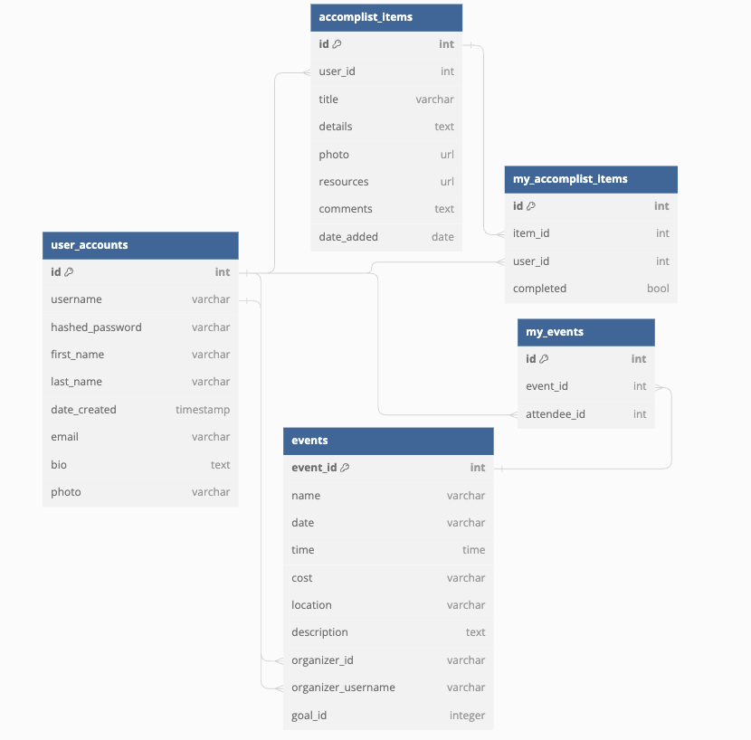

# Data models

## Visualization of Database

## Accounts

---
### user_accounts

| name             | type    | unique | optional | foreign key |
| ---------------- | ------  | ------ | -------- | ----------- |
| username         | string  | yes    | no       | no
| hashed_password  | string  | no     | no       | no
| first_name       | string  | no     | no       | no
| last_name        | string  | no     | no       | no
| date_created     | datetime| yes    | no       | no
| email            | int     | no     | no       | no
| bio              | string  | no     | yes      | no
| photo            | string  | no     | yes      | no

The `account` entity contains the data about a specific user.

---
### accomplist_items

| name             | type    | unique | optional | foreign key |
| ---------------- | ------  | ------ | -------- | ----------- |
| user_id          | int     | no     | no       | yes
| title            | string  | no     | no       | no
| details          | string  | no     | no       | no
| photo            | string  | no     | yes      | no
| resources        | string  | yes    | yes      | no
| comments         | string  | no     | yes      | no
| date_added       | date    | no     | yes      | no

The `accomplist_item` entity contains the data about for public accomplist items.
---
### events

| name               | type    | unique | optional | foreign key |
| ----------------   | ------  | ------ | -------- | ----------- |
| name               | string  | no     | no       | no
| date               | string  | no     | no       | no
| time               | string  | no     | no       | no
| cost               | string  | no     | no       | no
| location           | string  | yes    | no       | no
| description        | string  | no     | no       | no
| organizer_id       | int     | no     | yes      | yes
| organizer_username | string  | no     | yes      | yes
| goal_id            | int     | no     | yes      | yes

The `event` entity contains the data about for events that users can organize.

---
### my_accomplist_items

| name             | type    | unique | optional | foreign key |
| ---------------- | ------  | ------ | -------- | ----------- |
| item_id          | int     | no     | no       | yes
| user_id          | int     | no     | no       | yes
| completed        | bool    | no     | no       | no

The `my_accomplist_item` entity contains the data about for public accomplist items.
