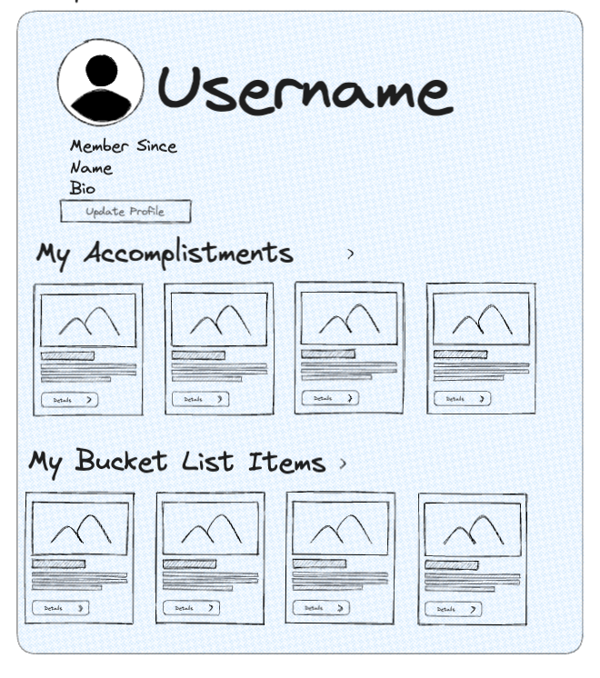

# Graphical Human Interface
## Landing Page

This will be the first page visitors arrive to on the website.
They will be able to View Accomplist Items or Visit Login/Create Account for further page access

## Main Page

This page will display a random list of accomplist items. You can sort by most wanted, most completed, date created (newest), and date created (oldest).

The search bar allows you to search the whole website.

You can click on an item to view the details.

## Accomplist Item Detail

This page allows you to see further details about the item and add your own photo, resource link and comment

## Create Account

This page allows logged in users to see their items and update their profiles

## Login

This page allows users to login

## My Profile

This page allows logged in users to see their items and update their profiles

## Update Profile

This page allows logged in users to update their profile

## Accomplist Item Create

This page allows logged in users to add their own item. The date added and user creating are automatically generated

## My Accomplist Item Create

This page allows logged in users to save accomplist items to their "done" or "will do" list. They can also delete and view their items

## Create Event

This page allows logged in users to create an event

# View Events

This page allows users to view events

